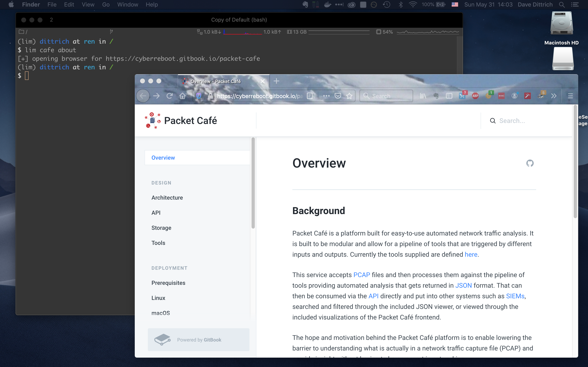
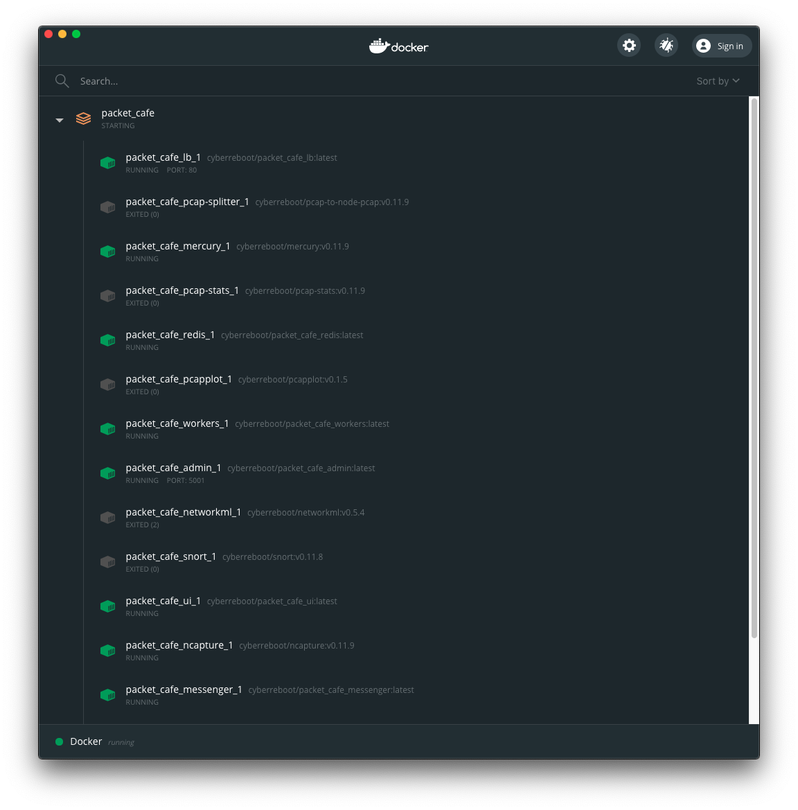
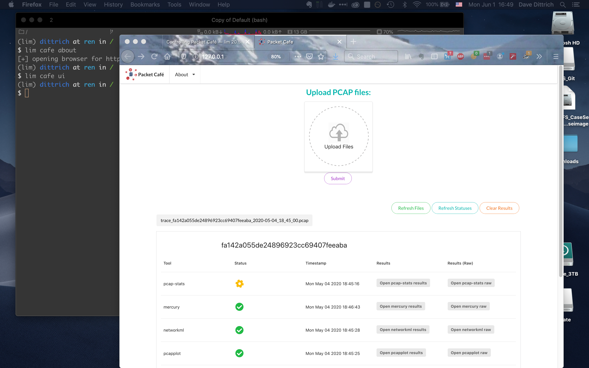

=======================
Controlling Packet Café
=======================

``lim`` serves as a command line interface to In-Q-Tel Labs'
`Packet Café`_ to process `PCAP`_ files you *upload* to the
local service.

.. epigraph::

    Packet Café is an analysis platform that pipelines data through a
    configurable suite of open source tools to better visualize and dissect
    PCAP data with an eye toward more intuitive analysis of network traffic
    data.

    -- `Packet Café`_ web site

Packet Café has both a Javascript-based web user interface (UI) and a REST API
that ``lim`` uses to communicate with the Packet Café service to provide a
command line interface (CLI).

To view the Packet Café web page, use ``lim cafe about``. This will
show the URL and also attempt to open a browser to the web page:

   Opening Packet Café web page

..

.. Screen shots for the Medium article about ``lim cafe`` subcommands
.. were made by playing the asciicast linked below in a browser in
.. full-screen mode, screen shot using ``screencapture -D 2`` on a Mac,
.. then edited by cropping down to just the commands and output.

.. note::

    Not all commands, nor all command line options, are shown in
    this section.  Just enough to show end-to-end use of ``lim``
    as a CLI for Packet Café is included here. See the section
    :ref:`usage` for full details of command usage.

    You can also watch the following asciicast to see ``lim cafe``
    commands in action:

    .. image:: https://asciinema.org/a/353492.png
       :target: https://asciinema.org/a/353492?autoplay=1
       :align: center
       :alt: ``lim`` subcommands for Packet Café API
       :width: 835px

    ..

..

Starting and Stopping Packet Café services
------------------------------------------

`Packet Café`_ runs all of its service workers, user interface, API, related
networks, etc., as a Docker container stack on the local host.

The service images are built from the ``packet_cafe`` repository directory,
while the tools run by the workers come from other GitHub repositories (the
primary one being `iqtlabs/network-tools`).  Those images are pulled from
Docker Hub when you bring the stack up using ``docker-compose``.

The Packet Café documentation describes using ``docker-compose up --build``
to build the images when bringing up the container stack. You can manually pull
the images if you wish before bringing up the stack, making the
``--build`` option unecessary in some cases.

The ``lim`` CLI simplifies the process by cloning the Packet Café repository
from GitHub as part of building and/or bringing the containers up. It also
fetches new content from the remote repository origin and will let you know
that you need to update.

.. code-block:: console

    $ lim cafe docker up
    [!] The branch "master" is not up to date
    [-] An update is available from remote "origin"
    [-] Use ``-update`` to pull before building

..

.. note::

    For advanced users who want to develop and test the Packet Café platform
    yourself, you can ``pull`` your own images by setting the namespace
    for the service and tool image repositories to reference your own
    account.  See ``lim cafe docker pull --help``.

The Packet Café `Deployment`_ section assumes you will be building building
images locally. Their instructions show how to clone the repository and use
``docker-compose`` directly.  These steps are handled by ``lim`` in the
background, so you only need to run one command to clone the repo and build the
containers.

.. code-block:: console

    $ lim cafe docker build
    [-] Directory "/Users/dittrich/packet_cafe" does not exist
    [+] Cloning from URL https://github.com/iqtlabs/packet_cafe.git
    [+] Cloning into '/Users/dittrich/packet_cafe'...
    [+] Running "docker-compose up --build" in /Users/dittrich/packet_cafe
    Creating network "packet_cafe_default" with the default driver
    Pulling networkml (iqtlabs/networkml:v0.6.0)...
    v0.6.0: Pulling from iqtlabs/networkml
     . . .
    Removing intermediate container 7a838368792e
     ---> b9768db0b583

    Successfully built b9768db0b583
    Successfully tagged iqtlabs/packet_cafe_workers:latest
    Creating packet_cafe_admin_1 ...
    Creating packet_cafe_messenger_1 ...
    Creating packet_cafe_pcap_stats_1 ...
    Creating packet_cafe_pcapplot_1   ...
    Creating packet_cafe_ui_1         ...
    Creating packet_cafe_networkml_1  ...
    Creating packet_cafe_lb_1         ...
    Creating packet_cafe_ncapture_1   ...
    Creating packet_cafe_redis_1      ...
    Creating packet_cafe_pcap-dot1q_1 ...
    Creating packet_cafe_messenger_1     ... done
    Creating packet_cafe_snort_1         ... done
    Creating packet_cafe_pcap-splitter_1 ... done
    Creating packet_cafe_web_1           ... done
    Creating packet_cafe_mercury_1       ... done

..

The containers are now running:

.. code-block:: console

    $ lim cafe docker ps
    +-------------------------+------------+--------------------------------------+---------+
    | name                    | short_id   | image                                | status  |
    +-------------------------+------------+--------------------------------------+---------+
    | packet_cafe_admin_1     | 4cc47659f3 | iqtlabs/packet_cafe_admin:latest     | running |
    | packet_cafe_web_1       | f9c61afd10 | iqtlabs/packet_cafe_web:latest       | running |
    | packet_cafe_workers_1   | b0621f3930 | iqtlabs/packet_cafe_workers:latest   | running |
    | packet_cafe_lb_1        | 8ab78663e6 | iqtlabs/packet_cafe_lb:latest        | running |
    | packet_cafe_ui_1        | fe73db6947 | iqtlabs/packet_cafe_ui:latest        | running |
    | packet_cafe_redis_1     | 92120824d1 | iqtlabs/packet_cafe_redis:latest     | running |
    | packet_cafe_messenger_1 | 25bf866dd3 | iqtlabs/packet_cafe_messenger:latest | running |
    +-------------------------+------------+--------------------------------------+---------+

..

When you want to stop the Docker containers, just do the following:

.. code-block:: console

        $ lim cafe docker down
        [+] Running "docker-compose down" in /Users/dittrich/packet_cafe
        Stopping packet_cafe_admin_1     ... done
        Stopping packet_cafe_web_1       ... done
        Stopping packet_cafe_workers_1   ... done
        Stopping packet_cafe_lb_1        ... done
        Stopping packet_cafe_ui_1        ... done
        Stopping packet_cafe_redis_1     ... done
        Stopping packet_cafe_messenger_1 ... done
        Removing packet_cafe_networkml_1     ... done
        Removing packet_cafe_admin_1         ... done
        Removing packet_cafe_pcap_stats_1    ... done
        Removing packet_cafe_web_1           ... done
        Removing packet_cafe_pcap-dot1q_1    ... done
        Removing packet_cafe_ncapture_1      ... done
        Removing packet_cafe_workers_1       ... done
        Removing packet_cafe_pcapplot_1      ... done
        Removing packet_cafe_pcap-splitter_1 ... done
        Removing packet_cafe_lb_1            ... done
        Removing packet_cafe_ui_1            ... done
        Removing packet_cafe_redis_1         ... done
        Removing packet_cafe_messenger_1     ... done
        Removing packet_cafe_mercury_1       ... done
        Removing packet_cafe_snort_1         ... done
        Removing network packet_cafe_default
        Removing network admin
        Removing network frontend
        Removing network results
        Removing network backend
        Removing network analysis
        Removing network preprocessing

..

.. note::

   The ``docker-compose.yml`` file requires that the environment variable
   ``VOL_PREFIX`` be set prior to running ``docker-compose up`` so the
   containers can volume mount a directory where workers write their output and
   related state. The Docker volume mount ensures these files are available
   from outside the containers. It will be set by ``lim`` internally prior to
   running ``docker-compose`` to simplify things. This documentation assumes
   this variable is set to ``$HOME/packet_cafe_data``.

..

   Docker Dashboard view of Packet Café containers

..

You can use ``docker ps --filter 'name=packet_cafe'`` to see the Packet
Café containers (and their status) by their name.  The command ``lim cafe
docker ps`` produces a table with just those containers having the label
``com.docker.compose.project`` set to ``packet_cafe`` and returns a standard
Unix exit code of ``0`` (success).  If the Packet Café Docker containers are
not running, a message to that effect is returend and an exit code of ``1``
(failure).

Adding the ``-q`` flag will suppress the table or warning for use in scripts.

.. # Copied from lim/packet_cafe/extensions/containers.py

.. code-block:: console

    $ lim cafe docker ps
    +-------------------------+------------+--------------------------------------+---------+
    | name                    | short_id   | image                                | status  |
    +-------------------------+------------+--------------------------------------+---------+
    | packet_cafe_messenger_1 | ce4eed9e01 | iqtlabs/packet_cafe_messenger:latest | running |
    | packet_cafe_workers_1   | 43fff494f6 | iqtlabs/packet_cafe_workers:latest   | running |
    | packet_cafe_ui_1        | 794eb87ed6 | iqtlabs/packet_cafe_ui:latest        | running |
    | packet_cafe_web_1       | a1f8f5f7cc | iqtlabs/packet_cafe_web:latest       | running |
    | packet_cafe_mercury_1   | 882b12e31f | iqtlabs/mercury:v0.11.10             | running |
    | packet_cafe_ncapture_1  | 5b1b10f3e0 | iqtlabs/ncapture:v0.11.10            | running |
    | packet_cafe_admin_1     | 73304f16cf | iqtlabs/packet_cafe_admin:latest     | running |
    | packet_cafe_redis_1     | c893c408b5 | iqtlabs/packet_cafe_redis:latest     | running |
    | packet_cafe_lb_1        | 4530125e8e | iqtlabs/packet_cafe_lb:latest        | running |
    +-------------------------+------------+--------------------------------------+---------+
    $ lim -q cafe docker ps
    $ echo $?
    0

..

.. code-block:: console

    $ lim cafe docker ps
    [-] no packet-cafe containers are running
    $ lim -q cafe docker ps
    $ echo $?
    1

..

Once all of the service containers are started and healthy, you should be able
to communicate with the server using ``lim``.  If they are not running, ``lim``
will let you know.

.. # Copied from lim/packet_cafe/api/info.py

.. code-block:: console

   $ lim cafe info
   +----------+---------------------------------+
   | Field    | Value                           |
   +----------+---------------------------------+
   | url      | http://127.0.0.1:80/api/v1/info |
   | version  | v0.1.0                          |
   | hostname | bf1456253115                    |
   +----------+---------------------------------+

..

The *admin* interface also has an ``info`` function.

.. # Copied from lim/packet_cafe/admin/info.py

.. code-block:: console

    $ lim cafe admin info
    +--------------+-------------------------------+
    | Field        | Value                         |
    +--------------+-------------------------------+
    | url          | http://127.0.0.1:5001/v1/info |
    | last_session | None                          |
    | last_request | None                          |
    | version      | v0.1.0                        |
    | hostname     | 5df1f9a14bff                  |
    +--------------+-------------------------------+

..

.. note::

    As a convenience when running multiple commands in sequence,
    ``lim`` keeps track of the last *session ID* and *request ID*
    and will reuse them by default. The values show up in the
    output of ``lim cafe admin info``. Otherwise, you would have to
    type or cut+paste these long UUIDs for every command, which
    is both a bit tedious and error prone. You can override this
    behavior and interactively select from existing session
    and request IDs by using the ``--choose`` flag on commands
    that require these IDs.

..

Uploading a PCAP file
---------------------

The workflow pipeline is triggered by uploading a PCAP file.

.. note::

    The section :ref:`ctu_datasets` describes how to use ``lim`` to search for
    and download PCAP files associated with malware and malicious activity
    captured in a sandbox.

..

For demonstration and repeatable testing purposes, there is a file in
the `packet_cafe` GitHub repository you can use. (It is assumed
here that you cloned the repo into the ``~/git/packet_cafe``
directory.)

By default, the generated session ID request ID are shown for
your information, and the progress of workers is tracked in
real-time similar to the web UI.

.. code-block:: console

    $ lim cafe upload ~/git/packet_cafe/notebooks/smallFlows.pcap
    [+] Upload smallFlows.pcap: success
    [+] Session ID (sess_id): 30b9ce67-75a4-49e6-b484-c4646b72fbd9
    [+] Request ID (req_id): 4e058115ed19491193eadf58f105032b
    [+] pcap_stats:    complete 2020-05-23T17:29:56.982084+00:00
    [+] pcap-dot1q:    complete 2020-05-23T17:29:55.773211+00:00
    [+] ncapture:      complete 2020-05-23T17:29:53.333307+00:00
    [+] mercury:       complete 2020-05-23T17:29:59.330288+00:00
    [+] snort:         complete 2020-05-23T17:30:02.781840+00:00
    [+] pcap-splitter: complete 2020-05-23T17:31:10.060056+00:00
    [+] networkml:     complete 2020-05-23T17:32:13.648982+00:00
    [+] p0f:           complete 2020-05-23T17:32:21.438466+00:00
    [+] pcapplot:      complete 2020-05-23T17:33:05.999342+00:00

..

If you use the ``--no-track`` option, the realtime status is skipped
and the command returns immediately. You can then get status as you
wish with ``lim cafe status``.

.. code-block:: console

    $ lim cafe status
    [+] implicitly reusing last session id bae5d69c-7180-445d-a8db-22a5ef0872e8
    [+] implicitly reusing last request id c33c56abe4c743a8b77e0b76d9548c06
    +---------------+----------+----------------------------------+
    | Tool          | State    | Timestamp                        |
    +---------------+----------+----------------------------------+
    | snort         | Complete | 2020-05-15T01:25:52.669640+00:00 |
    | networkml     | Complete | 2020-05-15T01:26:36.616426+00:00 |
    | pcap-splitter | Complete | 2020-05-15T01:25:56.362483+00:00 |
    | mercury       | Complete | 2020-05-15T01:25:49.773921+00:00 |
    | pcap-dot1q    | Complete | 2020-05-15T01:25:47.988746+00:00 |
    | ncapture      | Complete | 2020-05-15T01:25:46.075214+00:00 |
    | pcapplot      | Complete | 2020-05-15T01:26:24.899752+00:00 |
    | pcap_stats    | Complete | 2020-05-15T01:25:48.251749+00:00 |
    | p0f           | Complete | 2020-05-15T01:26:48.456883+00:00 |
    +---------------+----------+----------------------------------+

..

Tracking the last used session ID and request ID is helpful, but there
are times you want to access data associated with a different session ID
and request ID. If the last session ID is no longer in the server
(e.g., after you deleted it), or if you want to choose, you can do
this at any time with the ``--choose`` flag. You are presented with
interactive menus of available IDs from which to select with the
arrow keys and return key.

.. code-block:: console

    $ lim cafe status --choose

    Chose a session:
        <CANCEL>
      → 148aa08d-0760-40e1-aaab-2e3f7bb19ab6
        3219c581-55ff-4bc1-a801-bdea2ad6c438
        fa525546-8991-4457-9116-38c2615476d3
        73aba25b-cada-4ac2-8e87-771a16193e51
        57b1484b-5502-4e3c-b6bc-854d4aeb2038
        57be4843-32c0-4943-93d8-d1ec9bc0e792
        2d222a53-5b01-4d5e-a659-7da7c21d3cf6
        a42ee6ab-d60b-4d8e-a1df-cb3dc6985c81

    Chose a request:
        <CANCEL>
      → ab154ad99e7d4eb3ba1d36dd3e6a1d31
    +---------------+----------+----------------------------------+
    | Tool          | State    | Timestamp                        |
    +---------------+----------+----------------------------------+
    | p0f           | Complete | 2020-05-27T23:00:33.691910+00:00 |
    | snort         | Complete | 2020-05-27T22:59:17.237826+00:00 |
    | pcap-splitter | Complete | 2020-05-27T22:59:22.099207+00:00 |
    | pcap_stats    | Complete | 2020-05-27T22:59:11.146931+00:00 |
    | ncapture      | Complete | 2020-05-27T22:59:08.518450+00:00 |
    | mercury       | Complete | 2020-05-27T22:59:14.303015+00:00 |
    | pcapplot      | Complete | 2020-05-27T22:59:59.033611+00:00 |
    | networkml     | Complete | 2020-05-27T23:00:20.798256+00:00 |
    | pcap-dot1q    | Complete | 2020-05-27T22:59:10.728918+00:00 |
    +---------------+----------+----------------------------------+

..

Opening the web UI
------------------

As a convenience, there is a command that brings up a browser with
the Packet Café UI. It is (suprise!) ``lim cafe ui``.

   Opening Packet Café User Interface

..

Getting worker results
----------------------

After all workers are done processing, you can retrieve the results
from any of the tools, either in the form of HTML (the same HTML
the web UI uses to render results), or in "raw" JSON format.

The command for retrieving the HTML output is ``lim cafe results``
and the JSON file retrieval is ``lim cafe raw``. When you run the
latter command at the command line, colorized pretty-printed JSON
is put on ``stdout``.  Select the tool with ``--tool`` (the list
of available tools can be retrieved with ``lim cafe tools``.)

.. code-block:: console

    $ lim cafe raw --tool p0f | head -n 20
    [+] implicitly reusing last session id 148aa08d-0760-40e1-aaab-2e3f7bb19ab6
    [+] implicitly reusing last request id ab154ad99e7d4eb3ba1d36dd3e6a1d31
    [
      {
        "147.32.84.165": {
          "full_os": "Windows NT kernel",
          "short_os": "Windows",
          "link": "Ethernet or modem",
          "raw_mtu": "1500",
          "mac": "08:00:27:b5:b7:19"
        },
        "61.135.188.210": {
          "full_os": "Linux 2.4-2.6",
          "short_os": "Linux",
          "link": "Ethernet or modem",
          "raw_mtu": "1500",
          "mac": "00:1e:49:db:19:c3"
        },
        "61.135.188.212": {
          "full_os": "Linux 2.4-2.6",
          "short_os": "Linux",
          "link": "Ethernet or modem",

..

Getting a report
----------------

You can also get tabular output from the processed JSON worker
results for one, more than one, or all (using ``--all``) tools.

These reports are good for immediate situational awareness. More detailed
processing should be done using the output of ``lim cafe raw`` instead.

.. # copied from lim/packet_cafe/extensions/report.py

.. code-block:: console

    $ lim cafe report --tool p0f,networkml
    [+] implicitly reusing last session id 148aa08d-0760-40e1-aaab-2e3f7bb19ab6
    [+] implicitly reusing last request id ab154ad99e7d4eb3ba1d36dd3e6a1d31

    ************************************************************************************
                                      Packet Cafe Report

       Date produced: 2020-06-27T03:54:06.517174+00:00
       Session ID:    148aa08d-0760-40e1-aaab-2e3f7bb19ab6
       Request ID:    ab154ad99e7d4eb3ba1d36dd3e6a1d31
       File:          trace_a93591b554fe420ebbcf14b67fc8d298_2020-06-21_21_44_45.pcap
       Original File: test.pcap

    ************************************************************************************

    Worker results: p0f
    ===================

    +-----------------+----------------+----------+-------------------+---------+-------------------+
    | source_ip       | full_os        | short_os | link              | raw_mtu | mac               |
    +-----------------+----------------+----------+-------------------+---------+-------------------+
    | 10.0.2.102      | Windows 7 or 8 | Windows  | Ethernet or modem | 1500    | 08:00:27:5b:df:e1 |
    | 202.44.54.4     | Windows XP     | Windows  | Ethernet or modem | 1500    | 52:54:00:12:35:02 |
    | 190.110.121.202 | Windows XP     | Windows  | Ethernet or modem | 1500    | 52:54:00:12:35:02 |
    | 112.213.89.90   | Windows XP     | Windows  | Ethernet or modem | 1500    | 52:54:00:12:35:02 |
    +-----------------+----------------+----------+-------------------+---------+-------------------+

    Worker results: networkml
    =========================

    +------------+-------------------+------------+-------------------+----------+-------------+
    | source_ip  | source_mac        | role       |        confidence | behavior | investigate |
    +------------+-------------------+------------+-------------------+----------+-------------+
    | 10.0.2.102 | 08:00:27:5b:df:e1 | GPU laptop | 99.99999999539332 | normal   | no          |
    +------------+-------------------+------------+-------------------+----------+-------------+

..

Cleaning up
-----------

You can delete all files from the Packet Café server with a single
command:

.. code-block:: console

    $ lim cafe admin delete --all
    [+] deleted session 531f8bad-1f01-4b10-926b-a72aa27bcdba
    [+] deleted session e6129371-ab97-4225-940e-5b18cd761da7
    [+] deleted session 46d4f9a9-d5db-487e-a261-91764c044b44
    [+] deleted session f44dc0e5-2ad0-4cbd-aac9-98a6c8233dff
    [+] deleted session 5382b1b3-39f2-4563-9486-8efb99b56243
    $ (cd $VOL_PREFIX && tree .)
    .
    ├── definitions
    │   └── workers.json
    ├── files
    ├── id
    └── redis
        └── appendonly.aof

    4 directories, 2 files

..

.. _Packet Café: https://www.cyberreboot.org/projects/packet-cafe/
.. _PCAP: https://www.tcpdump.org/pcap.html
.. _Deployment: https://iqtlabs.gitbook.io/packet-cafe/deployment/prerequisites

.. EOF
